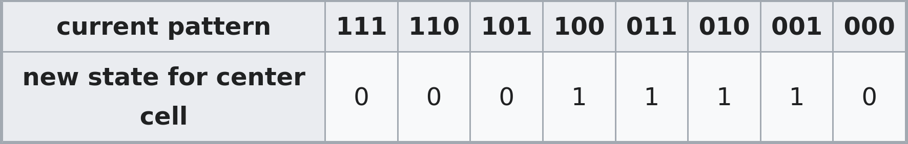
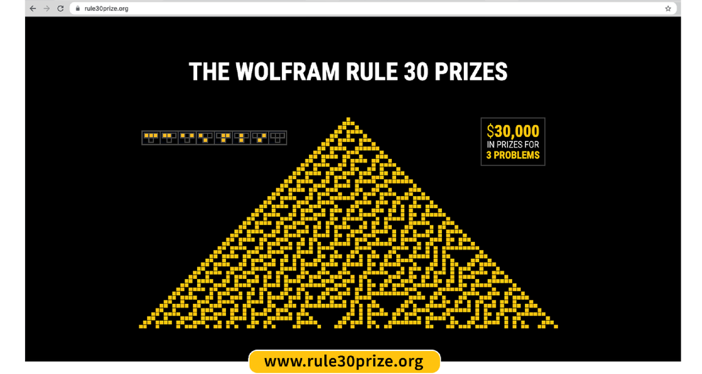

<div align="center">

# Pyramid Scheme: Unlocking Emergent Intelligence Through Cellular Automata


[](https://opensource.org/licenses/MIT)

---
###### At the intersection of mathematics and machine intelligence lies a profound mystery: How do simple rules give rise to complex behavior? Through distributed computation, we aim to unlock the secrets of emergence itself.
</div>

- [Introduction](#introduction)
- [The Rule 30 Challenge](#the-rule-30-challenge)
- [Overview of Miner and Validator Functionality](#overview-of-miner-and-validator-functionality)
  - [Miner](#miner)
  - [Validator](#validator)
- [Running a miner or validator](#running-a-miner-or-validator)
  - [Running a miner](#running-a-miner)
  - [Running a validator](#running-a-validator)
- [License](#license)


## Introduction

The Rule 30 subnet on Bittensor aims to tackle one of complexity science's most fundamental challenges: understanding how simple rules give rise to complex, seemingly random behavior. Through distributed computation and collective analysis, we're working to unlock the secrets of emergence itself—the mysterious process by which simple systems generate intricate, unpredictable patterns.

While major research institutions have explored these phenomena using traditional computing approaches, the computational demands of analyzing long-term pattern behavior have limited progress. The Rule 30 subnet represents a paradigm shift: harnessing the collective power of distributed computing to generate and analyze cellular automata patterns at an unprecedented scale.

Through this subnet, we aim to generate and analyze the first 1 trillion values of Rule 30's center column, potentially unlocking new approaches to cryptography, pattern recognition, and artificial intelligence.

## The Rule 30 Challenge

Cellular automata are mathematical models that demonstrate how complex behavior can emerge from simple rules. Rule 30, introduced by Stephen Wolfram, is particularly fascinating—despite following elementary rules, it generates patterns that appear random and unpredictable, challenging our understanding of complexity and computation.

**Here's how it works:**

The automaton operates on a grid where each cell can be either alive (white) or dead (black). Each new cell's state is determined by looking at three cells above it - itself and its two immediate neighbors

Starting from a single black cell, Rule 30 generates an intricate pattern that:
- Appears random in its center column
- Creates complex, asymmetric triangular patterns
- Never becomes periodic in its first billion steps

The transition rules for Rule 30 are:



<div align="center">
  


</div>


The name "Rule 30" comes from converting these output states to binary (00011110), which equals 30 in decimal.

Wolfram posed three fundamental questions about Rule 30 that remain unanswered:
1. **Pattern Periodicity**: Does the center column always remain non-periodic?
2. **Distribution Properties**: Does each color of cell occur on average equally often in the center column?
3. **Computational Complexity**: Does computing the nth cell of the center column require at least O(n) computational effort?

[](https://rule30prize.org)

These questions strike at the heart of complexity science and have profound implications for multiple fields:
- **Cryptography**: Understanding pattern generation for secure systems
- **Machine Learning**: Training models on emergent behavior
- **Complex Systems**: Predicting outcomes in chaotic systems


Recent research has demonstrated that transformer [models trained on cellular automata data exhibit enhanced performance on advanced tasks](http://www.arxiv.org/pdf/2410.02536). By generating a massive dataset of Rule 30 computations, our project enables new approaches to AI model training while working towards answers to Wolfram's fundamental questions.

## Overview of Miner and Validator Functionality

To solve the fundamental questions posed by Wolfram, our subnet coordinates validators and miners to collaboratively generate and analyze the first 1 trillion values of the center column of Rule 30.

### Miner

**Miners:** generate Rule 30 patterns by computing specified row ranges of the cellular automaton. Using optimized algorithms and parallel processing, miners calculate pattern segments that contribute to our goal of analyzing 1 trillion steps of Rule 30's center column.

### Validator

**Validators:** distribute computational tasks and verify results. Since Rule 30 is deterministic, validation is straightforward - each computation has exactly one correct answer. Validators check accuracy, measure response time, and reward miners accordingly.

## Running a miner or validator
To run either a miner or validator, create a .env file with the following content, and edit as needed(all are optional):
```bash
CHAIN_ENDPOINT=wss://entrypoint-finney.opentensor.ai:443
NETUID=36
EPOCH_LENGTH=100 # Interval length to sync metagraph or set weights

PORT=8091

WALLET_NAME=default
HOTKEY_NAME=default
WALLET_PATH=~/.bittensor/wallets
```

And then serve your Axon IP/port to chain:
```bash
# IP required, port optional(would use PORT otherwise)
cargo run --release --bin serve-axon 1.2.3.4 8091
```

And then run either the miner or validator binary

### Running a miner
```bash
# Without PM2:
cargo run --release --bin miner

# With PM2
pm2 start cargo --name rule-30-miner --interpreter none -- run --release  --bin miner
```

### Running a validator
```bash
# Without PM2:
cargo run --release --bin validator

# With PM2
pm2 start cargo --name rule-30-validator --interpreter none -- run --release --bin validator
```

## Roadmap

Given the complexity of analyzing and leveraging cellular automata for advanced computation and AI, we've divided our roadmap into three strategic phases:

**Phase 1: Infrastructure & Data Collection**

- [ ] Subnet launch with CPU computation and robust mechanism to calculate pattern segments
- [ ] Scalable data collection framework targeting major milestones: 1B, 10B, 100B rows, with path to 1T
- [ ] Public analytics dashboard for real-time pattern analysis and subnet metrics
- [ ] GPU acceleration implementation for enhanced computation speed

**Phase 2: Pattern Analysis & Research** 
- [ ] Research partnerships with academic institutions focused on cellular automata
- [ ] Open-source release of Rule 30 dataset with comprehensive analysis tools
- [ ] Development of pattern recognition models and benchmarking framework
- [ ] Integration with existing machine learning frameworks

**Phase 3: Advanced Applications**
- [ ] Integration of Rule 30 patterns into foundation model training
- [ ] Expansion to other elementary cellular automata rules
- [ ] Infrastructure adaptation for broader computational applications
- [ ] Research grants program for novel applications and discoveries


## License
The Rule 30 Bittensor subnet is released under the [MIT License](./LICENSE).

<div align="center">
  
  <p>Connect with us</p>
  <a href="https://twitter.com/wombo" style="margin-right: 10px;">
    
  </a>
  <a href="https://www.instagram.com/wombo.ai/">
    
  </a>
</div>
